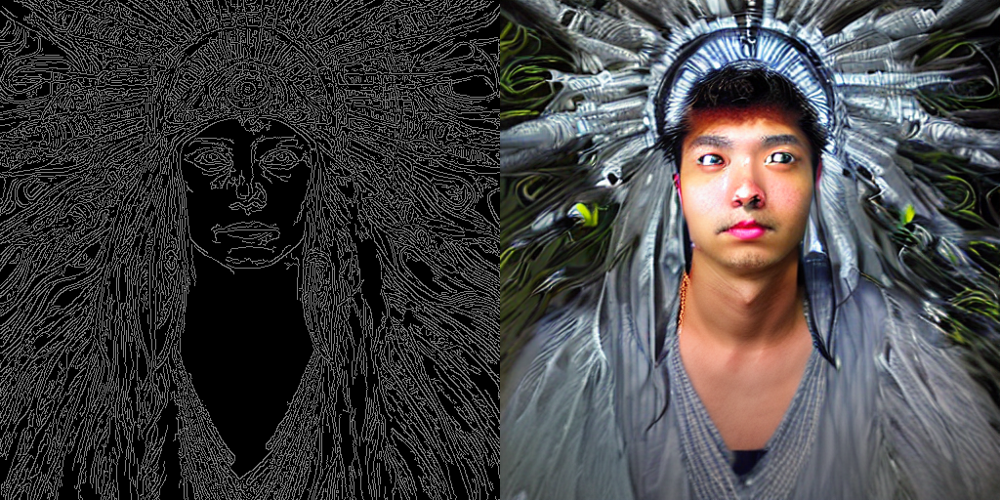
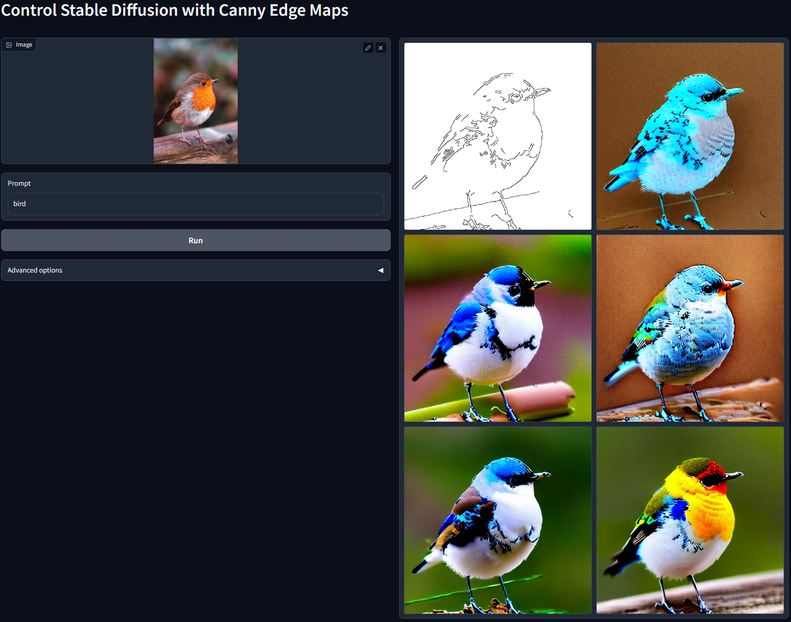
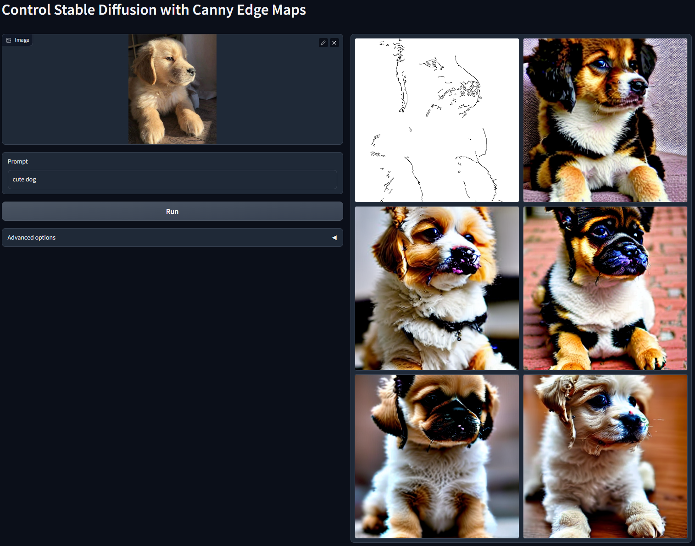
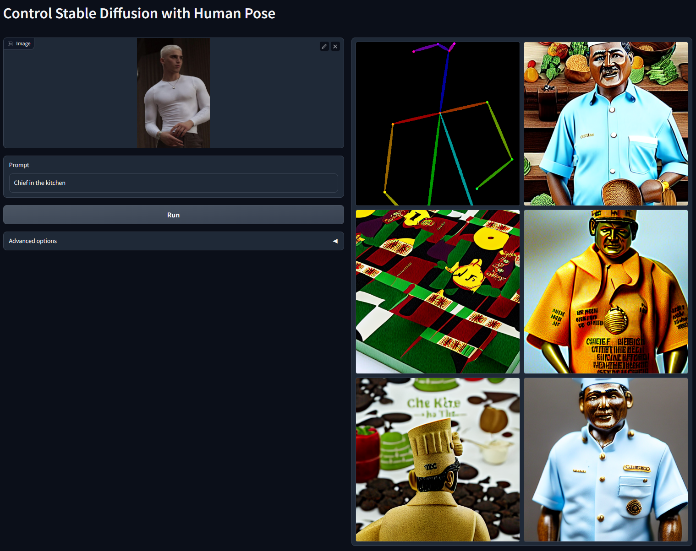
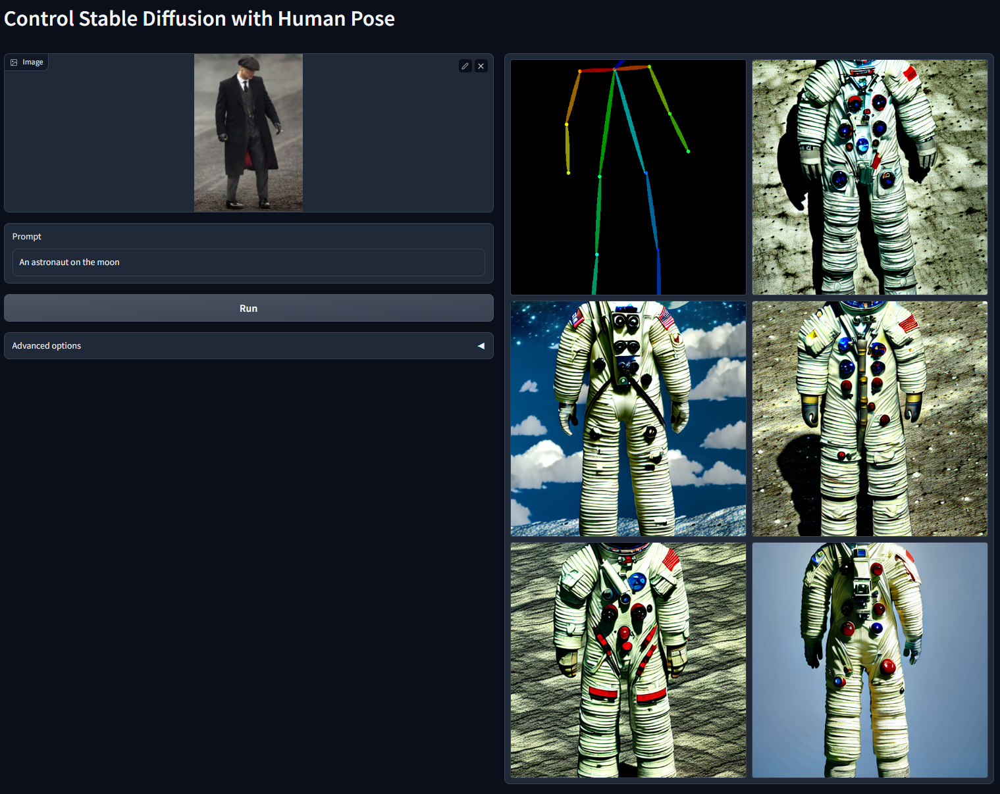
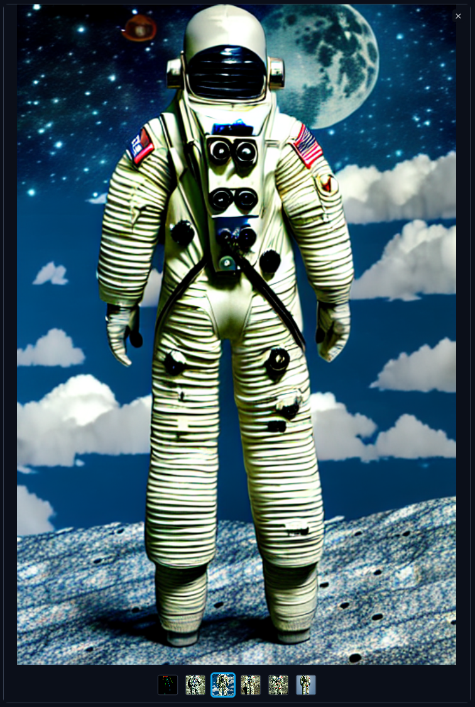

# ControlLoRA: 一个能够控制Stable Diffusion空间信息的轻量神经网络

🎉 ControlLoRA Version 2 可以在[control-lora-2](https://github.com/HighCWu/control-lora-v2)上使用了.

[EN](./README.md) | 中文

通过结合[lllyasviel/ControlNet](https://github.com/lllyasviel/ControlNet)和[cloneofsimo/lora](https://github.com/cloneofsimo/lora)的思想，我们可以轻松地使用ControlLoRA，一个简单而小的（~7M 参数，~25M 存储空间）网络，来微调稳定扩散以达到控制其空间信息的目的。

ControlNet很大，不容易发送给您的朋友。借用LoRA的思想，我们甚至不需要传输整个稳定的扩散模型。现在使用25M的ControlLoRA来节省您的时间。

您可以使用`apps`目录中的gradio应用程序来尝试预训练模型。我需要更多数据集类型的模型及其对应的gradio应用程序。`annotator`目录是从 ControlNet借来的。

您可以从[huggingface](https://huggingface.co/HighCWu/ControlLoRA)下载一些预训练模型。注意openpose的训练我只用了100张MPII图片，所以模型效果不好。所以我建议你自己训练ControlLoRA。

## 特性 & 新闻

2023/02/22 - 添加ControlLora新版本，将提示特征和空间信息进行分解，体积更小（~5M参数，~20M存储空间）。 您可以执行以下操作：在sd v1.5上进行训练，然后在Anything v3.0 上进行推理。

## 如何训练

请参阅`tasks`目录中的脚本。我高度参考了[diffusers](https://github.com/huggingface/diffusers)的训练代码。

您可以在`configs`目录中添加或修改配置文件以自定义 ControlLoRA 模型架构。为了增强模型的效果，您可以将一些块更改为diffusers中的其它类型残差块，并且可以通过修改配置文件来增加块的层数。

## 进行中的任务

- [ ] 实现ControlNet中提到的其它类型任务.

- [ ] 混合LoRA和ControlLoRA的实验.

    我们可以在 ControlLoRA 之前注入预训练的 LoRA 模型。 有关详细信息，请参阅“mix_lora_and_control_lora.py”。

    
    *portrait of male HighCWu*

## ControlLoRA 使用Canny边缘控制的模式

<strong>sd-diffusiondb-canny-model-control-lora, on 100 openpose pictures, 30k training steps</strong>

Stable Diffusion 1.5 + ControlLoRA (使用简单的Canny边缘检测)

    python apps/gradio_canny2image.py

高度参考自ControlNet的代码。

Gradio应用程序还允许您更改Canny边缘阈值。只需尝试了解更多详细信息。

Prompt: "bird"

Prompt: "cute dog"

## ControlLoRA 使用人类姿态控制的模式

<strong>sd-mpii-pose-model-control-lora, on 100 openpose pictures, 30k training steps</strong>

Stable Diffusion 1.5 + ControlLoRA (使用人类姿态)

    python apps/gradio_pose2image.py

高度参考自ControlNet的代码。

显然，这个模型应该有更好的UI来直接操作姿势骨架。然而，Gradio还是有点难以定制。现在您需要输入图像，然后Openpose会为您检测姿势。

注意，openpose的训练我只用了100张MPII图片，所以模型效果不好。所以我建议你自己训练 ControlLoRA。

Prompt: "Chief in the kitchen"

Prompt: "An astronaut on the moon"

PS：我不知道为什么我的画廊没有显示完整的图像，我应该点击一个输出来显示其中一个输出的完整结果，就像这样: 

# 一起讨论

QQ群: [艾梦的小群](https://jq.qq.com/?_wv=1027&k=yMtGIF1Q)

QQ频道: [艾梦的AI造梦堂](https://pd.qq.com/s/1qyek3j0e)

Discord: [AI Players - AI Dream Bakery](https://discord.gg/zcJszfPrZs)

# Citation

    @software{wu2023controllora,
        author = {Wu Hecong},
        month = {2},
        title = {{ControlLoRA: A Lightweight Neural Network To Control Stable Diffusion Spatial Information}},
        url = {https://github.com/HighCWu/ControlLoRA},
        version = {1.0.0},
        year = {2023}
    }
